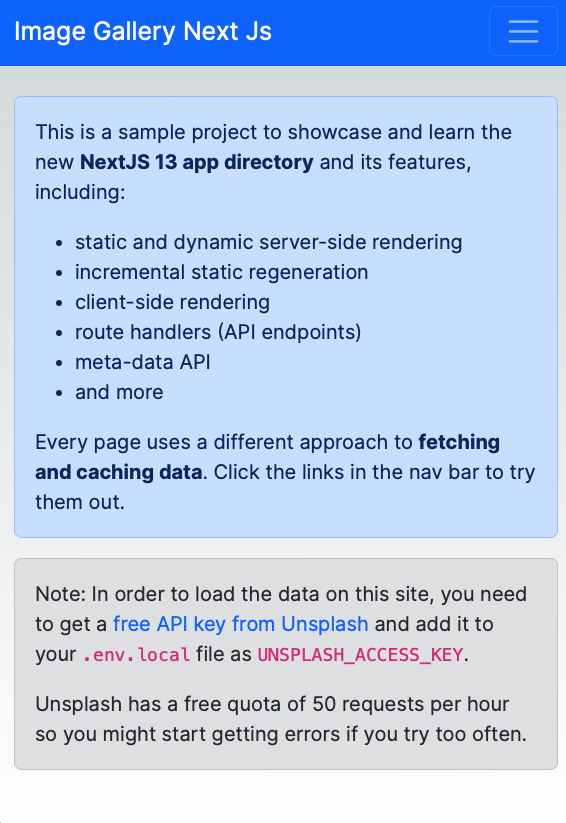
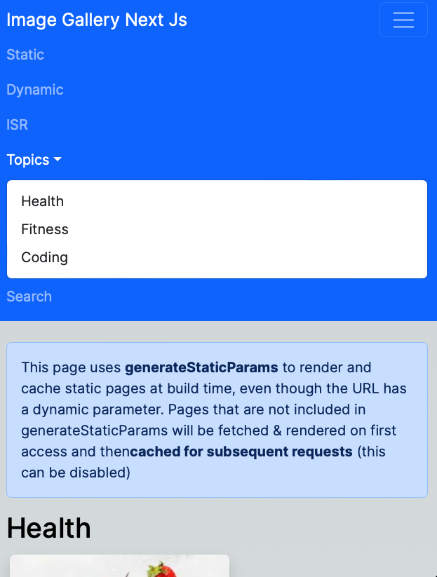
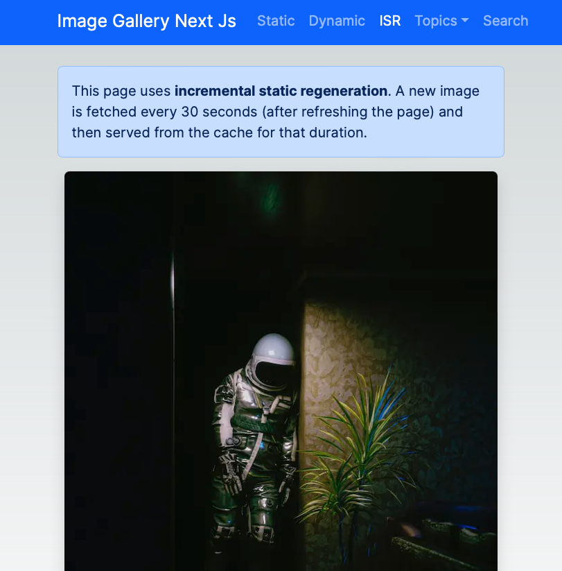
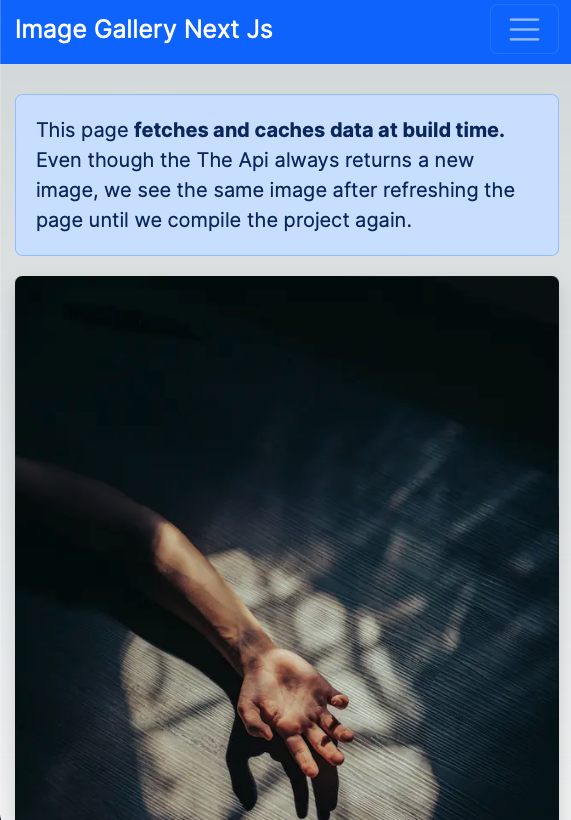

This is a [Next.js](https://nextjs.org/) project bootstrapped with [`create-next-app`](https://github.com/vercel/next.js/tree/canary/packages/create-next-app).


## How to Run

Make sure to create .env.local file in the root directory and then create variable with name `UNSPLASH_ACCESS_KEY` and you can get this api key from [Unsplash Develeoper](https://unsplash.com/developers) page.

And then you can run the development server:

```bash
npm run dev
# or
yarn dev
# or
pnpm dev
# or
bun dev
```

## About

Hi, This is the second time I use Next js and the first time I use the new app router, the porpuse of this project is to get started with it and not make a good production ready app, so it's not the best app ever






I know it sound not very useful but I would like to share my code in repositories on Github

Thank you for your time.

